# Лабораторная работа 2

**ФИО:** Пустовой Алексей
**Группа:** IA2404
**Уровень:** Продвинутый  
**Приложение:** open_capsules_php_functional  
**Вариант деплоя:** A  

---

## 1. Скриншоты базового уровня

### Задание 1

На скриншоте показан созданный бюджет `ZeroSpend` в AWS Budgets.

### Задание 2
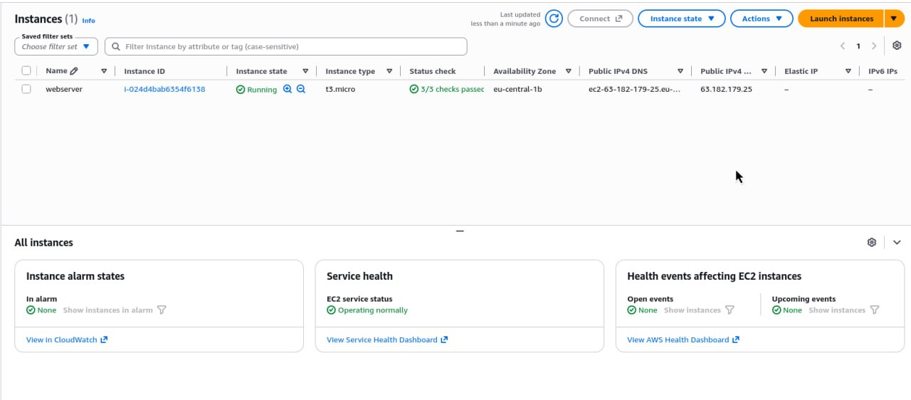

Экземпляр `webserver` находится в состоянии `Running`, все проверки пройдены.

### Задание 2
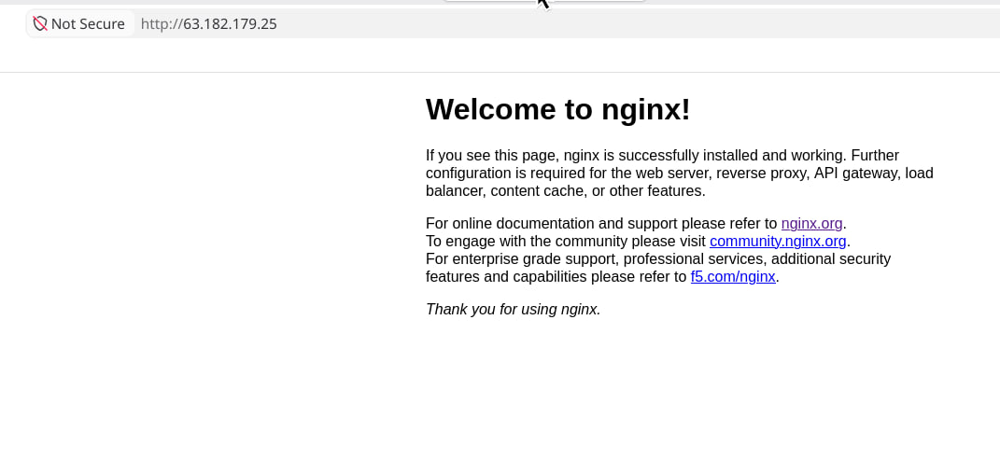

В браузере открыта стандартная страница nginx по публичному IP-адресу.

### Задание 3
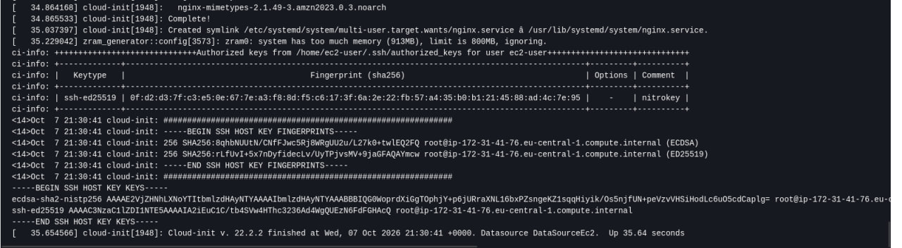

Показаны метрики мониторинга EC2 и системный лог с установкой nginx.

### Задание 4
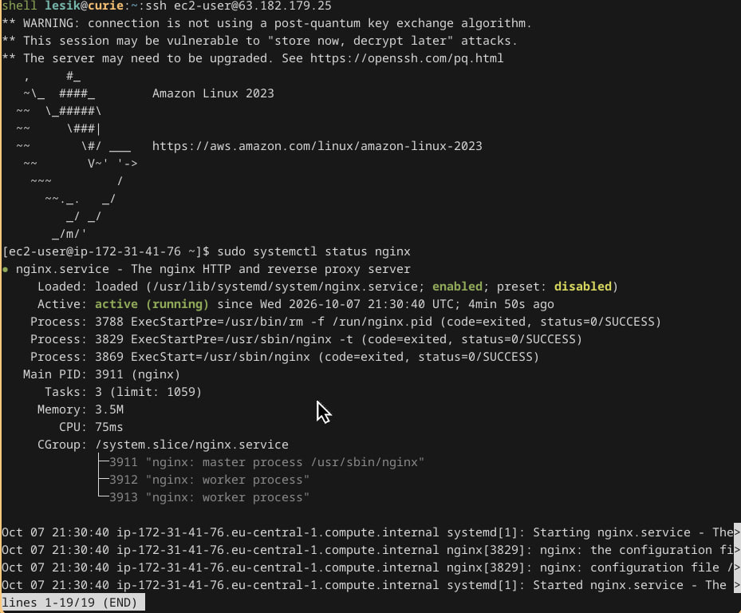

Выполнено успешное SSH-подключение и проверен статус nginx.

### Задание 5
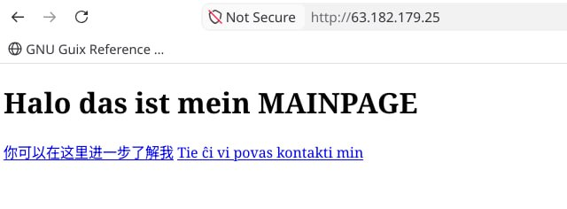
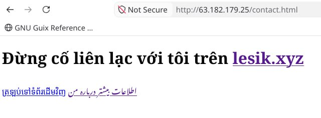

В браузере открыт созданный статический сайт.

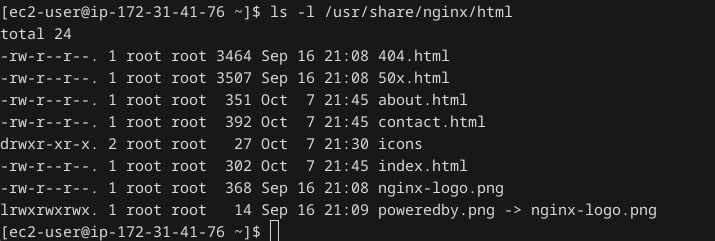

Показано содержимое `/usr/share/nginx/html` с файлами сайта.

### Задание 6
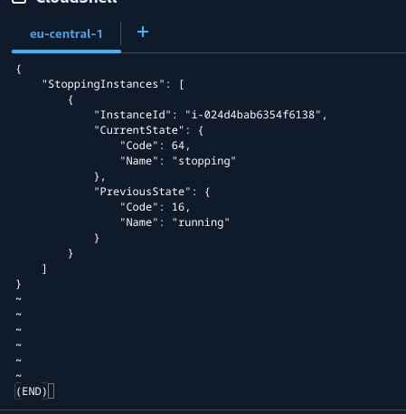

Выполнена команда `aws ec2 stop-instances` для остановки экземпляра.

### Задание 9
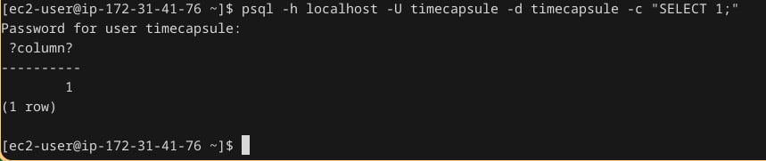

Проверено подключение к PostgreSQL командой `SELECT 1`.

### Задание 10
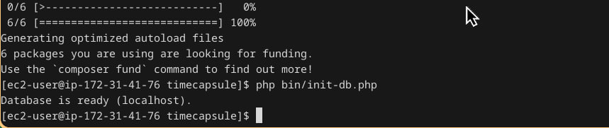

Выполнена инициализация базы данных командой `php bin/init-db.php`.

### Задание 11
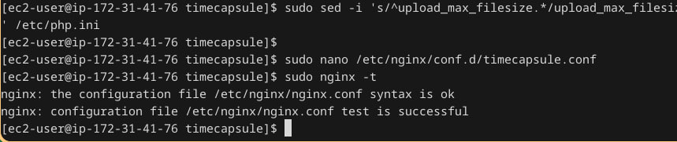
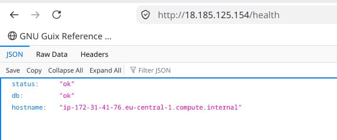

Конфигурация nginx успешно проверена, приложение открывается, `/health` возвращает успешный статус.

### Задание 12
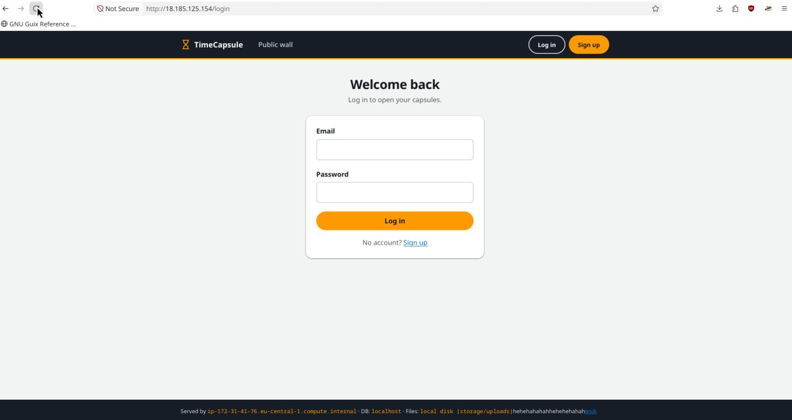

Задеплоено всё хихихи.

### Задание 13
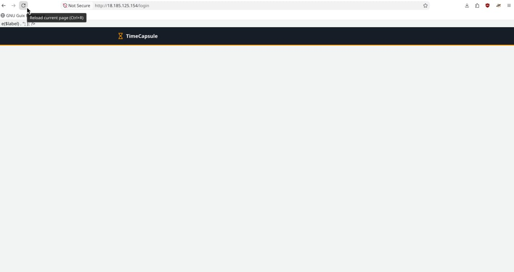

После сломанного деплоя сайтик не работал, после `git revert` и повторного деплоя сайт снова работает.

## Архитектура

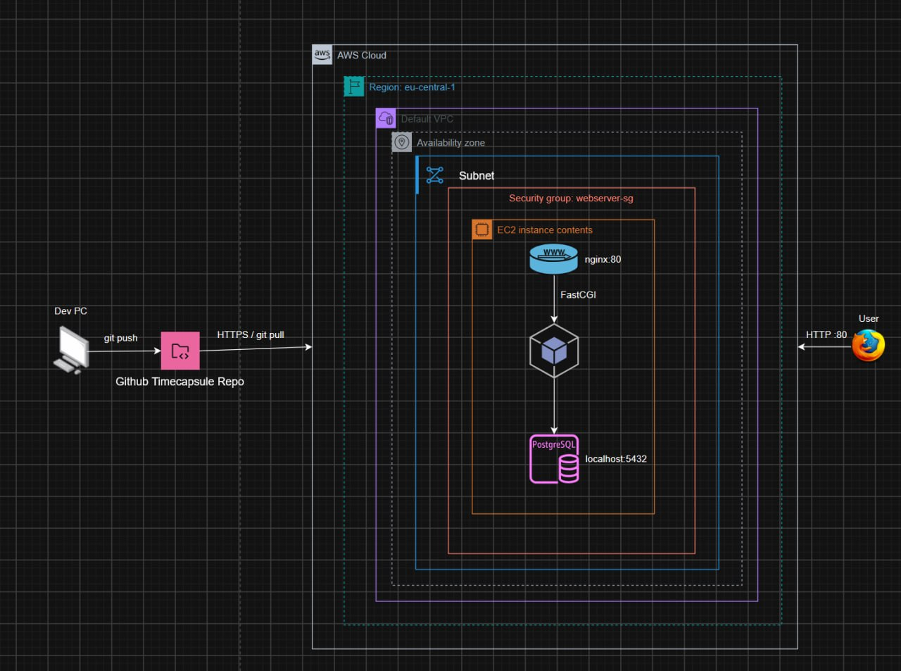

## Ответи на вопроси

1. **AdministratorAccess** даёт почти полный доступ к AWS. Root нельзя использовать постоянно, потому что его компрометация опасна для всего аккаунта.

2. **User data** - скрипт первоначальной настройки EC2, обычно выполняется при первом запуске и не повторяется после обычной перезагрузки.

3. **Instance status check** показывает проблемы внутри ВМ, а **System status check** — проблемы инфраструктуры AWS.

4. **Detailed monitoring** нужен, когда важны более точные данные о нагрузке и метрики каждую минуту.

5. SSH использует ключи, потому что они безопаснее паролей и не требуют передачи пароля по сети.

6. `scp` безопасно копирует файлы через SSH, а `ssh` используется для удалённого подключения и выполнения команд.

7. `Stop` останавливает ВМ, но сохраняет её данные; `Terminate` удаляет ВМ. При `Stop` продолжают оплачиваться, например, EBS-диски.

8. `vendor/` и `.env` не попали в GitHub, потому что они указаны в `.gitignore`; `.env` содержит секреты.

9. Из за несовершенства нашей ОС. В Fedora CoreOS мы бы делали именно так.

10. Пароль БД хранится в `.env`, чтобы не публиковать секрет в GitHub. Поэтому исходный код можно хранить в публичном репозитории.

11. nginx принимает HTTP-запросы и передаёт PHP-запросы PHP-FPM, который выполняет код и при необходимости обращается к PostgreSQL.

12. Во время `git pull` пользователь может временно получить старую/новую версию или ошибку. Если не выполнить `composer install`, приложению могут не хватить новых зависимостей.

13. `/health` проверяет только базовую работоспособность приложения и БД, поэтому он может работать даже при ошибке главной страницы.

14. В `/health` не хватает проверки реальных пользовательских сценариев: входа, создания капсулы, загрузки файла и т.д.

15. Время простоя складывается из обнаружения ошибки, исправления, `git push` и повторного деплоя; автоматические тесты и CI/CD сократили бы это время.

16. Запрос идёт **браузер -> nginx -> PHP-FPM -> PHP-приложение -> PostgreSQL -> обратно**.

17. Сервер может читать публичный GitHub-репозиторий, но не может делать `push` без прав. Это безопаснее: взломанный сервер не сможет изменить код.

18. По умолчанию при удалении (терминации) EC2 его EBS-том также удаляется, поэтому файлы пользователей будут потеряны. Если настроить EBS-том на сохранение при терминации, его можно оставить и подключить к другому экземпляру EC2.

19. Последовательность команд варианта A выполняет те же основные шаги, что и CI/CD: получение новой версии кода, установку зависимостей и обновление приложения. Не хватает автоматического запуска деплоя, тестирования, проверки ошибок и возможности автоматически откатить неудачное обновление.
